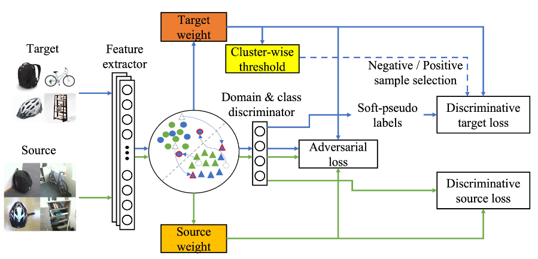
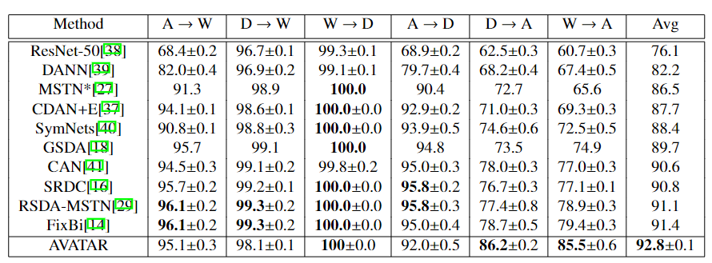
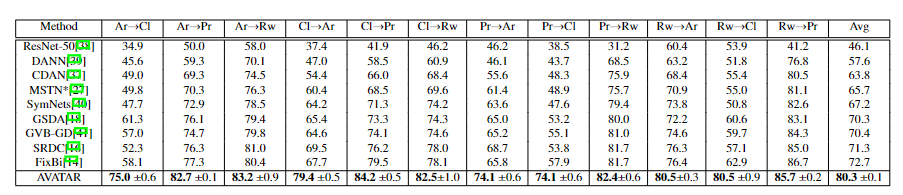
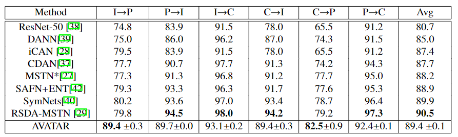

# AVATAR2022
Code release for AdVersarial self-superVised domain Adaptation network for TArget domain (AVATAR)

> **Abstract:** 
*This paper presents an unsupervised domain adaptation (UDA) method for predicting unlabeled target domain data, specific to complex UDA tasks where the domain gap is significant. Mainstream UDA models aim to learn from both domains and improve target discrimination by utilizing labeled source domain data. However, the performance boost may be limited when the discrepancy between the source and target domains is large, or the target domain contains outliers. To explicitly address this issue, we propose the Adversarial self-superVised domain Adaptation network for the TARget domain (AVATAR) algorithm. It outperforms state-of-the-art UDA models by concurrently reducing domain discrepancy while enhancing discrimination through domain adversarial learning, self-supervised learning, and sample selection strategy for the target domain, all guided by deep clustering. Our proposed model significantly outperforms state-of-the-art methods on three UDA benchmarks, and extensive ablation studies and experiments demonstrate the effectiveness of our approach.*


# Table of Contents
  - [Architecture](#Architecture)
  - [Requirements](#Requirements)
  - [Dataset](#Dataset)
  - [Training](#Training)
  - [Performance](#Performance)
  - [Citation](#Citation)

# Architecture

*Green and blue arrows indicate computational flow for the source and target domain, respectively. The extracted features using the feature extractor are embedded into a domain-invariant space. Source and target weights are computed based on the cosine similarity between target cluster centroids and each sample in the domain-invariant feature space. A cluster-wise threshold is computed based on the target weight. Finally, each target domain sample is assigned as a negative or positive transfer sample based on the threshold value and target weight.*

# Requirements
- Python 3.8.5
- Pytorch 1.9.1

# Dataset
## [Office-31](https://drive.google.com/file/d/0B4IapRTv9pJ1WGZVd1VDMmhwdlE/view)
## [Office-home](https://drive.google.com/file/d/0B81rNlvomiwed0V1YUxQdC1uOTg/view?usp=sharing&resourcekey=0-2SNWq0CDAuWOBRRBL7ZZsw)

The structure of the dataset should be like
```
Office31
|_ amazon
|  |_ back_pack
|     |_ <im-1-name>.jpg
|     |_ ...
|  |_ bike
|     |_ <im-1-name>.jpg
|     |_ ...
|  |_ ... (omit 28 classes)
|  |_ trash_can
|     |_ <im-1-name>.jpg
|     |_ ...
|_ amazon_half
|  |_ back_pack
|     |_ <im-1-name>.jpg
|     |_ ...
|  |_ bike
|     |_ <im-1-name>.jpg
|     |_ ...
|  |_ ... (omit 28 classes)
|  |_ trash_can
|     |_ <im-1-name>.jpg
|     |_ ...
|_ amazon_half2
|  |_ back_pack
|     |_ <im-1-name>.jpg
|     |_ ...
|  |_ bike
|     |_ <im-1-name>.jpg
|     |_ ...
|  |_ ... (omit 28 classes)
|  |_ trash_can
|     |_ <im-1-name>.jpg
|     |_ ...
|_ dslr
|  |_ back_pack
|     |_ <im-1-name>.jpg
|     |_ ...
|  |_ bike
|     |_ <im-1-name>.jpg
|     |_ ...
|  |_ ... (omit 28 classes)
|  |_ trash_can
|     |_ <im-1-name>.jpg
|     |_ ...
|_ ...
```
# Training
Replace arguments in run_avatar.sh with those in your system.

# Performance
## Office 31

## Office-home

## Image-CLEF


# Citations
```
@InProceedings{AVATAR,
  title={AdVersarial self-superVised domain Adaptation network for TArget domain (AVATAR)},
  author={Jun Kataoka and Hyunsoo Yoon},
  year={2022},
}
```