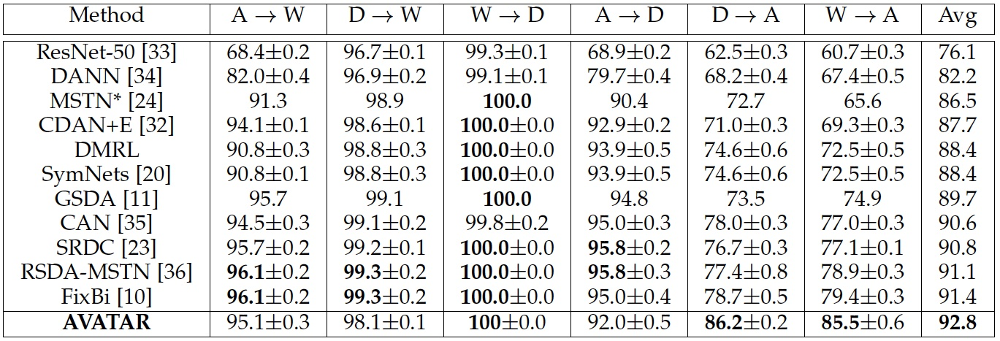
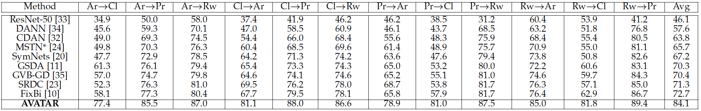

# AVATAR2022
Code release for AdVersarial self-superVised domain Adaptation network for TArget domain (AVATAR)

# Requirements
- Python 3.8.5
- Pytorch 1.9.1

# Dataset
## [Office-31](https://drive.google.com/file/d/0B4IapRTv9pJ1WGZVd1VDMmhwdlE/view)
The structure of the dataset should be like
```
Office31
|_ amazon
|  |_ back_pack
|     |_ <im-1-name>.jpg
|     |_ ...
|  |_ bike
|     |_ <im-1-name>.jpg
|     |_ ...
|  |_ ... (omit 28 classes)
|  |_ trash_can
|     |_ <im-1-name>.jpg
|     |_ ...
|_ amazon_half
|  |_ back_pack
|     |_ <im-1-name>.jpg
|     |_ ...
|  |_ bike
|     |_ <im-1-name>.jpg
|     |_ ...
|  |_ ... (omit 28 classes)
|  |_ trash_can
|     |_ <im-1-name>.jpg
|     |_ ...
|_ amazon_half2
|  |_ back_pack
|     |_ <im-1-name>.jpg
|     |_ ...
|  |_ bike
|     |_ <im-1-name>.jpg
|     |_ ...
|  |_ ... (omit 28 classes)
|  |_ trash_can
|     |_ <im-1-name>.jpg
|     |_ ...
|_ dslr
|  |_ back_pack
|     |_ <im-1-name>.jpg
|     |_ ...
|  |_ bike
|     |_ <im-1-name>.jpg
|     |_ ...
|  |_ ... (omit 28 classes)
|  |_ trash_can
|     |_ <im-1-name>.jpg
|     |_ ...
|_ ...
```
# Training
Replace arguments in a_to_w_run.sh with those in your system.

# Performance
## Office 31

## Office-home


# Citations
```
@InProceedings{AVATAR,
  title={AdVersarial self-superVised domain Adaptation network for TArget domain (AVATAR)},
  author={Jun Kataoka and Hyunsoo Yoon},
  booktitle={INFORMS 2022},
  year={2022},
}
```